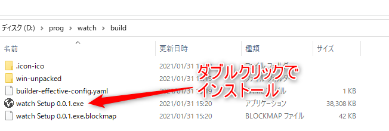

# World Watch

世界各地の現在時刻を複数個表示するアプリケーションです。
表示するだけではなく、OBSなどの配信ツールでウィンドウキャプチャすることが可能です。

## インストール方法

Releasesから最新版のzipファイルをダウンロードします。
解凍後、watchフォルダー内の`watch Setup 0.0.1.exe`を起動します。
起動するとインストールが開始され、完了すると自動的にアプリが起動します。
一度インストールするとデスクトップにショートカットが作成されるので、そちらから起動できます。

## 操作方法

Escキーを押すことで設定が開きます。
設定画面では時計の追加、それぞれの時計のタイムゾーン、フォント、色などの設定が可能です。
不要な時計は削除ボタンで消すことも可能です。

設定画面を閉じる場合は再度Escキーを押してください。